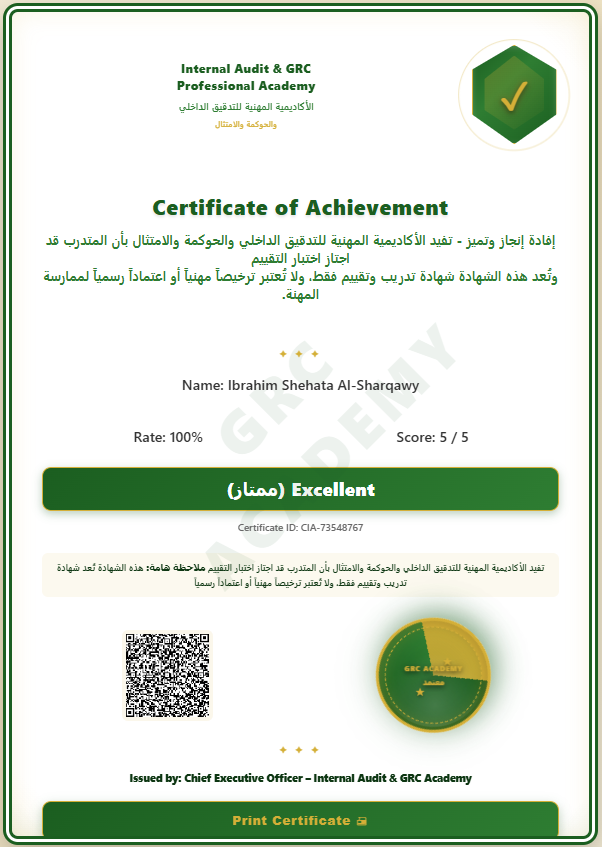

# CIA Simulator

Professional Examination & Certification Platform

## Overview

CIA Simulator is a web-based examination platform for Internal Audit, Governance, Risk Management, Compliance (GRC), and CIA exam preparation.

## Features

- Randomized Exams
- Question Bank
- Instant Results
- Professional Certificates
- QR Code Verification
- Certificate Registry

## Author

Ibrahim Shehata Al-Sharqawy  
Internal Audit & GRC Professional Academy  

---

## Sample Certificate

  

